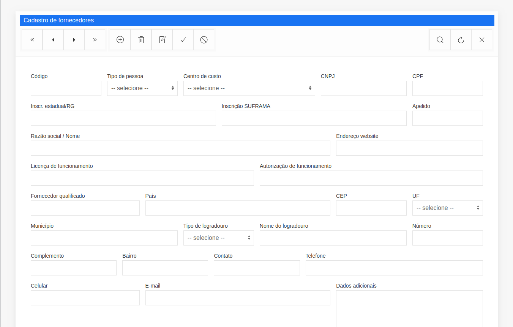

# JS Biz Framework

A business applications oriented JS framework.

## What is this?
JS Biz Framework was created to meet a very specific need: developing business web applications.

## Motivation
In 2007 I started writing a desktop application aimed at small industries. In 2013 I began to feel the need of a web version, but there was a lot to migrate. Fortunately, most part of the application was built over a framework that renders CRUD forms, formsets, menus, and reports. So, if I wrote a web client that was able to parse the definitions for the existing desktop framework, I could magically migrate a wide portion of the system. Early in 2018 I began a project called [reagent-metaforms](https://github.com/hbolzan/reagent-metaforms) written in ClojureScript and, after a year of hard work, it proved to be a great failure. In 2019 I decided to start it all over, writing in JS this time.

## But, after all, what does it do?
So far, it takes a definition like <details><summary>this</summary>

```
{
  "status":"OK",
  "query":"Complex Tables",
  "data":[
    {
      "id":"cad-fornecedores",
      "dataset-name":"view_nfe_fornecedores",
      "title":"Cadastro de fornecedores",
      "pk-fields":[
        "id"
      ],
      "auto-pk":true,
      "order-by-fields":[
        "id"
      ],
      "permissions":{
        "insert":true,
        "edit":true,
        "delete":true
      },
      "fields-defs":[
        {
          "order":1,
          "name":"id",
          "label":"Código",
          "field-kind":"data",
          "required":false,
          "visible":true,
          "search-visible":true,
          "read-only":false,
          "persistent?":true,
          "data-type":"integer",
          "alignment":"default",
          "default":null,
          "size":4,
          "width":7,
          "lookup-key":"",
          "lookup-result":"",
          "lookup-filter":"",
          "validation":null,
          "search-result?":true,
          "line-break?":false,
          "additional-params":{},
          "search-result-order":4
        },
        {
          "order":3,
          "name":"tipo_de_pessoa",
          "label":"Tipo de pessoa",
          "field-kind":"lookup",
          "required":false,
          "visible":true,
          "search-visible":false,
          "read-only":false,
          "persistent?":true,
          "data-type":"char",
          "alignment":"default",
          "default":"J",
          "size":20,
          "width":11,
          "lookup-key":"id",
          "lookup-result":"descricao",
          "lookup-filter":"",
          "validation":null,
          "search-result?":false,
          "line-break?":false,
          "additional-params":{},
          "search-result-order":null,
          "options":[
            {
              "id":"J",
              "descricao":"Jurídica"
            },
            {
              "id":"F",
              "descricao":"Física"
            }
          ]
        },
        {
          "order":24,
          "name":"cep",
          "label":"CEP",
          "field-kind":"data",
          "required":false,
          "visible":true,
          "search-visible":false,
          "read-only":false,
          "persistent?":true,
          "data-type":"char",
          "alignment":"default",
          "default":null,
          "size":20,
          "width":15,
          "lookup-key":"",
          "lookup-result":"",
          "lookup-filter":"",
          "validation":{
            "service":"common_validations",
            "method":"cep",
            "single-argument":null,
            "named-arguments":{},
            "expected-results":{
              "nome_do_logradouro":"subject_data.logradouro",
              "bairro":"subject_data.bairro",
              "uf":"subject_data.uf",
              "ibge_municipio":"subject_data.ibge"
            },
            "show-message-on-error":true,
            "before-validate":null
          },
          "search-result?":false,
          "line-break?":false,
          "additional-params":{},
          "search-result-order":null,
          "mask":"99999-999",
          "mask-char":"_",
          "format-chars":{
            "9":"[0-9]",
            "a":"[A-Za-z]",
            "A":"[A-Z]",
            "*":"[A-Za-z0-9]"
          }
        },

        ... lots of fields definitions

      ]
    }
  ]
}
```
</details>

And renders a CRUD form like this


## Features

* Basic hiccup lib - for me, it makes much more sense than writing HTML templates.
* Crud generator.
* Reports generator.
