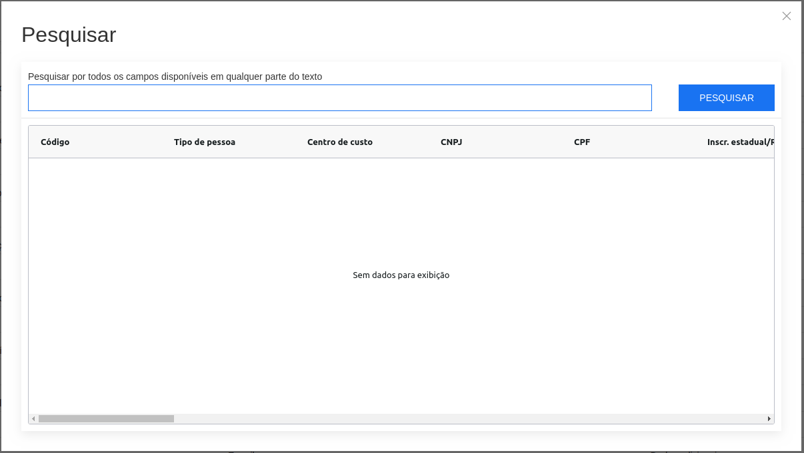

# JS Biz Framework

A business applications oriented JS framework.

## What is this?
JS Biz Framework was created to meet a very specific need: developing business web applications.

## Motivation
In 2007 I started writing a desktop application aimed at small industries. In 2013 I began to feel the need of a web version, but there was a lot of code to migrate. Fortunately, a large portion of the application was built over a framework that renders CRUD forms, formsets, menus, and reports. So, if I wrote a web client that was able to parse the definitions for the existing desktop framework, I could magically migrate lots of forms and reports. Early in 2018 I started a project called [reagent-metaforms](https://github.com/hbolzan/reagent-metaforms) written in ClojureScript. After a year of hard work, it ended up being a huge failure. In 2019 I decided to start it all over, writing in JS this time.

## But, after all, what does it do?
So far, it takes a JSON definition like 
<details><summary><strong>THIS</strong> (Click to see JSON definition)</summary>

```
{
  "status":"OK",
  "query":"Complex Tables",
  "data":[
    {
      "id":"cad-fornecedores",
      "dataset-name":"view_nfe_fornecedores",
      "title":"Cadastro de fornecedores",
      "pk-fields":[
        "id"
      ],
      "auto-pk":true,
      "order-by-fields":[
        "id"
      ],
      "permissions":{
        "insert":true,
        "edit":true,
        "delete":true
      },
      "fields-defs":[
        {
          "order":1,
          "name":"id",
          "label":"Código",
          "field-kind":"data",
          "required":false,
          "visible":true,
          "search-visible":true,
          "read-only":false,
          "persistent?":true,
          "data-type":"integer",
          "alignment":"default",
          "default":null,
          "size":4,
          "width":7,
          "lookup-key":"",
          "lookup-result":"",
          "lookup-filter":"",
          "validation":null,
          "search-result?":true,
          "line-break?":false,
          "additional-params":{},
          "search-result-order":4
        },
        {
          "order":3,
          "name":"tipo_de_pessoa",
          "label":"Tipo de pessoa",
          "field-kind":"lookup",
          "required":false,
          "visible":true,
          "search-visible":false,
          "read-only":false,
          "persistent?":true,
          "data-type":"char",
          "alignment":"default",
          "default":"J",
          "size":20,
          "width":11,
          "lookup-key":"id",
          "lookup-result":"descricao",
          "lookup-filter":"",
          "validation":null,
          "search-result?":false,
          "line-break?":false,
          "additional-params":{},
          "search-result-order":null,
          "options":[
            {
              "id":"J",
              "descricao":"Jurídica"
            },
            {
              "id":"F",
              "descricao":"Física"
            }
          ]
        },
        {
          "order":24,
          "name":"cep",
          "label":"CEP",
          "field-kind":"data",
          "required":false,
          "visible":true,
          "search-visible":false,
          "read-only":false,
          "persistent?":true,
          "data-type":"char",
          "alignment":"default",
          "default":null,
          "size":20,
          "width":15,
          "lookup-key":"",
          "lookup-result":"",
          "lookup-filter":"",
          "validation":{
            "service":"common_validations",
            "method":"cep",
            "single-argument":null,
            "named-arguments":{},
            "expected-results":{
              "nome_do_logradouro":"subject_data.logradouro",
              "bairro":"subject_data.bairro",
              "uf":"subject_data.uf",
              "ibge_municipio":"subject_data.ibge"
            },
            "show-message-on-error":true,
            "before-validate":null
          },
          "search-result?":false,
          "line-break?":false,
          "additional-params":{},
          "search-result-order":null,
          "mask":"99999-999",
          "mask-char":"_",
          "format-chars":{
            "9":"[0-9]",
            "a":"[A-Za-z]",
            "A":"[A-Z]",
            "*":"[A-Za-z0-9]"
          }
        },

        ... lots of fields definitions

      ]
    }
  ]
}
```
</details>

And renders a CRUD form like this


It comes with a modal search window


## HTML Templating
At the beginning of this project I searched for existing template engines like [Handlebars ](https://handlebarsjs.com/) or [Mustache](https://mustache.github.io/), but since I was introduced to the [hiccup](https://github.com/weavejester/hiccup/wiki) library, it makes much more sense to me to declare html as data structures rather than the traditional html templating approach. Since the markup is declared as data, it's not necessary to make string interpolations or use some specific template language. The only language you need is JS. So I wrote a simple hiccup like library that allows me to write views in the hiccup way.

The "hiccup like" syntax is
```
["tag", attributes, "content", [child, child-2, ...]]
```
Attributes, content and children are all optional, so any list where the first element is a valid html tag, is a valid hiccup structure.

Attributes is an object containing keys values that will be rendered as html attributes
```
["div", { id: "unique-element-id"}]
```

If an attribute value is an array, its elements will be rendered as string of values separeted by spaces. This is useful to declare multiple classes in an html element.
```
["p" { class: ["class-a", "class-b", "class-c"]} "Paragraph content"]

<p class="class-a class-b class-c">Paragraph content</p>
```

When the attribute value is an object, it will be rendered as key/value pairs separated by semicolons. It is useful to declare style attributes.
```
["div" { style: { color: "blue", maxHeight: "300px" }} "Some content"]

<div style="color: blue; max-height: 300px">Some content</p>
```
Note that camel case key names will be automatically converted to kebab case.


Here are some more examples
```
import { toHtml } from "src/logic/hiccup.js"

toHtml(["div", "This is a div"]) 
  => <div>This is a div</div>

toHtml(["div", { class: ["some-class", "other-class"] }, "This is a div"]) 
  => <div class="some-class other-class">This is a div</div>
```

With nested children
```
import { toHtml } from "src/logic/hiccup.js"

toHtml(["div", { class: ["list-class"] },
        ["ul",
         ["li", "First item"],
         ["li", "Second item"],
         ["li", "Third item"]]]) => <div class="list-class">
                                      <ul>
                                        <li>First item</li>
                                        <li>Second item</li>
                                        <li>Third item</li>
                                      </ul>
                                    </div>
```

Since it's just data, it can be built by a function
```
import { toHtml } from "src/logic/hiccup.js"

function todoList(items) {
    return ["ul"].concat(items.map( i => ["li", i])]);
}

toHtml(todoList(["First", "Second", "Third"])) => <ul>
                                                    <li>First</li>
                                                    <li>Second</li>
                                                    <li>Third</li>
                                                  </ul>
```
This approach allows to write components that are easily composable and extensible, and easier to reason about.

## Features

* Crud generator.
* Reports generator.
